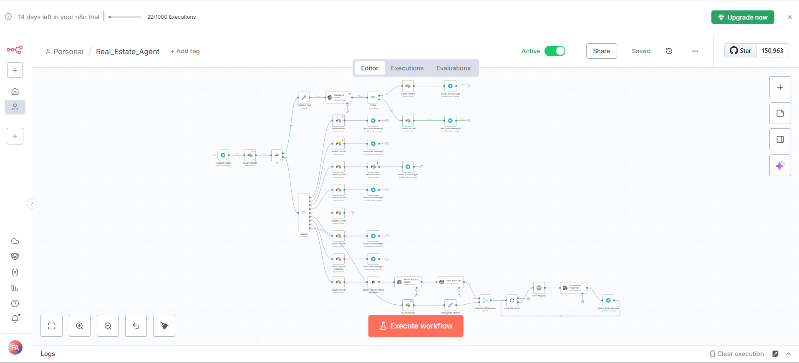

# Real-Estate-Agent-workflow
An n8n workflow to automate common tasks for real estate agents

# AI Real Estate Agent Chatbot (n8n + Telegram + Airtable + OpenAI)

## 🚀 Description

This project implements an automated AI Real Estate Agent chatbot using n8n. The bot interacts with users via **Telegram**, handles inquiries from both property **sellers** and potential **buyers**, manages conversation state using **Airtable**, leverages **OpenAI** for natural language understanding and data extraction, and searches for properties using **SerpApi**.

The primary goal is to automate the initial lead qualification and information gathering process for a real estate agent operating in Karachi, Pakistan.

---

## ✨ Features

* **Dual Conversation Paths:** Handles separate conversational flows for users looking to **sell** property and users looking to **buy** property.
* **AI Intent Recognition:** Uses OpenAI (`gpt-3.5-turbo` or similar) to determine if a user is a buyer or seller based on their initial message.
* **Stateful Conversations:** Manages multi-turn conversations using an **Airtable** base (`Conversations` table) to store session state (`Status`, collected data).
* **Seller Data Collection:** Collects seller's name, email, property address, and asking price through a series of questions.
* **Buyer Qualification:** Collects buyer's desired area and budget.
* **Automated Property Search ("Scout"):**
    * Searches an internal **Airtable** `Properties` table for matching listings.
    * Uses **SerpApi** to perform Google searches targeting Zameen.com and Graana.com based on buyer criteria.
    * Utilizes **OpenAI** to extract key details (description, price, image URL, listing URL) from external search results.
* **Property Presentation:** Presents matching properties (from internal and external searches) to the buyer directly in the Telegram chat, including **photos** (via URL extraction) and details.
* **(Optional) CRM Integration:** Includes logic to eventually pass collected seller data to a separate workflow or function to add/update records in a main CRM (Airtable `Contacts` and `Properties` tables). *(Note: Currently merged within the main workflow for simplicity).*

---

## 🛠️ Tech Stack

* **Automation Platform:** [n8n](https://n8n.io/) (Cloud or Self-Hosted)
* **Chat Interface:** [Telegram Bot API](https://core.telegram.org/bots/api)
* **Database / Memory:** [Airtable](https://airtable.com/)
* **AI / NLP:** [OpenAI API](https://openai.com/api/) (GPT-3.5/GPT-4 models)
* **Web Search:** [SerpApi](https://serpapi.com/) (Google Search API)

---

## ⚙️ Setup & Installation

Follow these steps to get the workflow running:

1.  **Prerequisites:**
    * An active **n8n** instance (Cloud or Self-Hosted).
    * A **Telegram Bot Token** obtained from BotFather.
    * An **Airtable** account with a base set up (see Airtable Setup below).
    * An **OpenAI API Key**.
    * A **SerpApi API Key**.

2.  **Import Workflow:**
    * Download the `workflow.json` file from this repository.
    * In your n8n instance, import the workflow file.

3.  **Airtable Setup:**
    * Create an Airtable base (e.g., "Karachi Based CRM").
    * Create a table named **`Conversations`** with the following fields (adjust types as needed):
        * `SessionID` (Single line text) - *Primary Field*
        * `Status` (Single line text)
        * `ClientType` (Single select - options: "Seller", "Buyer")
        * `CollectedName` (Single line text)
        * `CollectedEmail` (Single line text)
        * `CollectedAddress` (Single line text)
        * `CollectedPrice` (Number, Integer or Decimal)
        * `CollectedArea` (Single line text)
        * `CollectedBudget` (Number, Integer or Decimal)
    * Create a table named **`Properties`** to store your internal listings. Ensure it has fields like `Name`/`Description`, `Area`, `Price(PKR)`, `Status` (e.g., 'For sale'), and potentially an `Attachments` field for photos or a `URL` field for image links.
    * *(Optional: Create a `Contacts` table if separating contact info).*

4.  **Configure n8n Credentials:**
    * Navigate to **Credentials** in your n8n instance.
    * Create credentials for:
        * **Airtable:** Using your Airtable API Key or Personal Access Token.
        * **Telegram Bot:** Using the token from BotFather.
        * **OpenAI:** Using your OpenAI API Key.
        * **SerpApi:** Using your SerpApi API Key.

5.  **Configure Workflow Nodes:**
    * Open the imported workflow in n8n.
    * **Airtable Nodes:** Select your Airtable credential and ensure the correct Base and Table names are selected. Double-check any `Filter By Formula` expressions match your exact field names.
    * **Telegram Nodes:** Select your Telegram credential.
    * **OpenAI Nodes:** Select your OpenAI credential.
    * **SerpApi Node:** Select your SerpApi credential.
    * **Expressions:** Carefully review all expressions, especially those referencing node names (e.g., `{{ $node["Search records"]... }}`) to ensure they match the actual names of the nodes in your workflow.

---

## ▶️ Usage

1.  **Testing (Manual):**
    * Ensure the workflow is **`Inactive`**.
    * Use the **Manual Logic Test** method:
        * Execute the `Telegram Trigger` node to capture a message.
        * Manually execute subsequent nodes step-by-step to test logic.
        * Use the **"Set Mock Data"** feature on the `Telegram Trigger` to simulate client replies for ongoing conversations.
        * Remember to **clear the Airtable `Conversations` table** before starting a new test run for a "new client."
2.  **Live (Demonstration/Limited Use - Requires Fix):**
    * *(Note: The live `Telegram Trigger` connection was unreliable during development. The primary testing method is manual execution.)*
    * If the trigger issue is resolved: Set the workflow to **`Active`**. Interact with the bot directly via your Telegram app.

---

##  workflow Overview

The workflow operates based on a state machine logic managed via the `Status` field in the Airtable `Conversations` table.

1.  **Trigger:** Receives a message via Telegram.
2.  **Memory Check:** Searches Airtable `Conversations` for an existing session based on the `Chat ID`.
3.  **Branching (New vs. Ongoing):** An `IF` node routes the flow based on whether a conversation was found.
4.  **New Conversation:**
    * AI classifies intent (Buyer/Seller).
    * Airtable record is created with initial `Status` and `ClientType`.
    * The first question is sent via Telegram.
5.  **Ongoing Conversation:**
    * `Switch` node routes based on the current `Status`.
    * Relevant `Update record` node saves the received data and updates the `Status` to the next step.
    * `Telegram` node asks the next question.
6.  **Buyer Path Completion (Scout Logic):**
    * Searches internal `Properties`.
    * Searches external sites via `SerpApi`.
    * Uses OpenAI to extract details from external results.
    * Uses OpenAI to parse text into JSON.
    * Merges internal and external results.
    * Loops through results, sending photos/text via Telegram.

-
